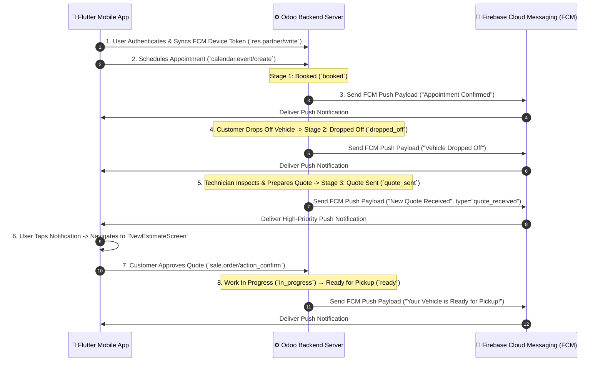

# Odoo to Flutter Mobile App: Job Stage & Inspection Notification Architecture

## 1. Executive Summary

This specification outlines the technical architecture and implementation roadmap for tracking detailing job stages (Appointment Booked → Drop-off → Inspection → Quote Received → Work In Progress → Ready for Pickup) and delivering real-time **Push & In-App Notifications** from the **Odoo Client Portal / Backend** to the **Timeless Detailing Flutter Mobile App**.

---

## 2. End-to-End Workflow Architecture



---

## 3. Job Stage State Machine

| Stage Code | Display Name | Trigger Condition | Notification Type | Destination Screen in App |
| :--- | :--- | :--- | :--- | :--- |
| `booked` | Appointment Booked | Booking created via App / Odoo | `stage_update` | `UpcomingAppointmentDetailsScreen` |
| `dropped_off` | Vehicle Dropped Off | Garage staff checks in vehicle | `stage_update` | `UpcomingAppointmentDetailsScreen` |
| `inspecting` | Under Inspection | Technician starts digital inspection | `stage_update` | Tracking Screen |
| `quote_sent` | New Quote Received | Tech sends revised estimate | `quote_received` | `NewEstimateScreen` |
| `in_progress` | Work In Progress | Customer approves quote | `stage_update` | Live Tracking Screen |
| `ready` | Ready for Pickup | Quality check completed | `stage_update` | `UpcomingAppointmentDetailsScreen` |
| `completed` | Completed | Vehicle handed over & paid | `stage_update` | Bookings History Screen |

---

## 4. Odoo Backend Specification

### 4.1 Partner FCM Token Storage (`res.partner`)

Extend `res.partner` to store active mobile FCM device tokens:

```python
# models/res_partner.py
from odoo import models, fields

class ResPartner(models.Model):
    _inherit = 'res.partner'

    fcm_token = fields.Char(string="FCM Mobile Device Token", index=True)
    fcm_token_last_updated = fields.Datetime(string="FCM Token Last Updated")
```

### 4.2 Booking Model Stage Override & Notification Trigger

Override `write()` and `create()` on `calendar.event` or custom `detailing.booking` to trigger FCM notifications on stage transitions:

```python
# models/detailing_booking.py
import requests
import json
from odoo import models, fields, api, _

class DetailingBooking(models.Model):
    _inherit = 'calendar.event'

    stage = fields.Selection([
        ('booked', 'Appointment Booked'),
        ('dropped_off', 'Vehicle Dropped Off'),
        ('inspecting', 'Under Inspection'),
        ('quote_sent', 'Quotation Received'),
        ('in_progress', 'Work in Progress'),
        ('ready', 'Ready for Pickup'),
        ('completed', 'Completed'),
    ], default='booked', string="Job Stage", tracking=True)

    @api.model
    def create(self, vals):
        res = super(DetailingBooking, self).create(vals)
        res._trigger_stage_notification("Appointment Confirmed", "Your appointment has been successfully scheduled!")
        return res

    def write(self, vals):
        res = super(DetailingBooking, self).write(vals)
        if 'stage' in vals:
            for record in self:
                stage_label = dict(record._fields['stage'].selection).get(record.stage)
                if record.stage == 'quote_sent':
                    record._trigger_stage_notification(
                        title="New Quote Received",
                        body="Based on our inspection, we have shared an updated quote. Please review.",
                        notification_type="quote_received"
                    )
                else:
                    record._trigger_stage_notification(
                        title=f"Update: {stage_label}",
                        body=f"Your vehicle stage has been updated to {stage_label}.",
                        notification_type="stage_update"
                    )
        return res

    def _trigger_stage_notification(self, title, body, notification_type="stage_update"):
        for record in self:
            partner = record.partner_ids[:1] or record.user_id.partner_id
            if partner and partner.fcm_token:
                self._send_fcm_push(
                    token=partner.fcm_token,
                    title=title,
                    body=body,
                    data={
                        "booking_id": str(record.id),
                        "type": notification_type,
                        "stage": record.stage or "",
                    }
                )

    def _send_fcm_push(self, token, title, body, data):
        # Implementation using FCM HTTP v1 REST API
        # Send POST request to https://fcm.googleapis.com/v1/projects/{project_id}/messages:send
        pass
```

---

## 5. Flutter Mobile App Architecture

### 5.1 Firebase Dependencies (`pubspec.yaml`)

```yaml
dependencies:
  firebase_core: ^3.0.0
  firebase_messaging: ^15.0.0
  flutter_local_notifications: ^17.0.0
```

### 5.2 Notification Service Implementation (`notification_service.dart`)

```dart
// lib/core/services/notification_service.dart
import 'package:firebase_messaging/firebase_messaging.dart';
import 'package:flutter/material.dart';
import 'package:timeless_detailing_customer_app/core/network/odoo_client.dart';
import 'package:timeless_detailing_customer_app/core/utils/app_animations.dart';
import 'package:timeless_detailing_customer_app/features/bookings/views/new_estimate_screen.dart';

class NotificationService {
  final FirebaseMessaging _fcm = FirebaseMessaging.instance;
  final BaseOdooService _odooService;

  NotificationService(this._odooService);

  Future<void> initialize(BuildContext context) async {
    // Request permission
    NotificationSettings settings = await _fcm.requestPermission(
      alert: true,
      badge: true,
      sound: true,
    );

    if (settings.authorizationStatus == AuthorizationStatus.authorized) {
      // Fetch FCM Token & Sync with Odoo res.partner
      String? token = await _fcm.getToken();
      if (token != null) {
        await _syncFcmTokenToOdoo(token);
      }

      // Listen for token refresh
      _fcm.onTokenRefresh.listen(_syncFcmTokenToOdoo);

      // Handle Foreground Messages
      FirebaseMessaging.onMessage.listen((RemoteMessage message) {
        _showForegroundBanner(context, message);
      });

      // Handle Notification Click (App opened from background/terminated)
      FirebaseMessaging.onMessageOpenedApp.listen((RemoteMessage message) {
        _handleNotificationNavigation(context, message.data);
      });
    }
  }

  Future<void> _syncFcmTokenToOdoo(String fcmToken) async {
    final partnerId = _odooService.currentPartnerId ?? _odooService.currentUid;
    if (partnerId == null) return;
    try {
      await _odooService.callKw({
        'model': 'res.partner',
        'method': 'write',
        'args': [
          [partnerId],
          {'fcm_token': fcmToken},
        ],
        'kwargs': {},
      });
    } catch (e) {
      debugPrint("Failed to sync FCM Token to Odoo: $e");
    }
  }

  void _handleNotificationNavigation(BuildContext context, Map<String, dynamic> data) {
    final type = data['type'];
    if (type == 'quote_received') {
      Navigator.push(
        context,
        FadeSlidePageRoute(
          page: const NewEstimateScreen(),
        ),
      );
    }
  }

  void _showForegroundBanner(BuildContext context, RemoteMessage message) {
    ScaffoldMessenger.of(context).showSnackBar(
      SnackBar(
        content: Text("${message.notification?.title}: ${message.notification?.body}"),
        backgroundColor: const Color(0xFFC4913F),
        duration: const Duration(seconds: 4),
        action: SnackBarAction(
          label: 'VIEW',
          textColor: Colors.white,
          onPressed: () => _handleNotificationNavigation(context, message.data),
        ),
      ),
    );
  }
}
```

---

## 6. FCM Push Data Payload Format

```json
{
  "message": {
    "token": "eXz8L...customer_device_fcm_token",
    "notification": {
      "title": "New Quote Received",
      "body": "Based on our inspection, we've shared an updated quote. Please have a review."
    },
    "data": {
      "type": "quote_received",
      "booking_id": "42",
      "stage": "quote_sent",
      "click_action": "FLUTTER_NOTIFICATION_CLICK"
    }
  }
}
```

---

## 7. Implementation Roadmap Checklist

- [ ] **Odoo Phase**:
  - Add `fcm_token` field on `res.partner`.
  - Add `stage` selection field on `calendar.event` / `detailing.booking`.
  - Override `create()` & `write()` to trigger FCM push API on stage changes.
- [ ] **Flutter App Phase**:
  - Add `firebase_core` & `firebase_messaging` packages.
  - Implement `NotificationService` and sync FCM token via `res.partner/write`.
  - Configure background & foreground notification click listeners to route to `NewEstimateScreen` / `UpcomingAppointmentDetailsScreen`.
  - Bind dynamic Dashboard card status to `BookingsController`.
